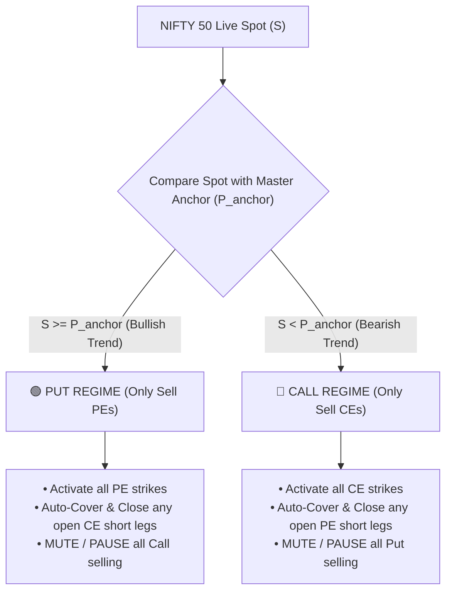
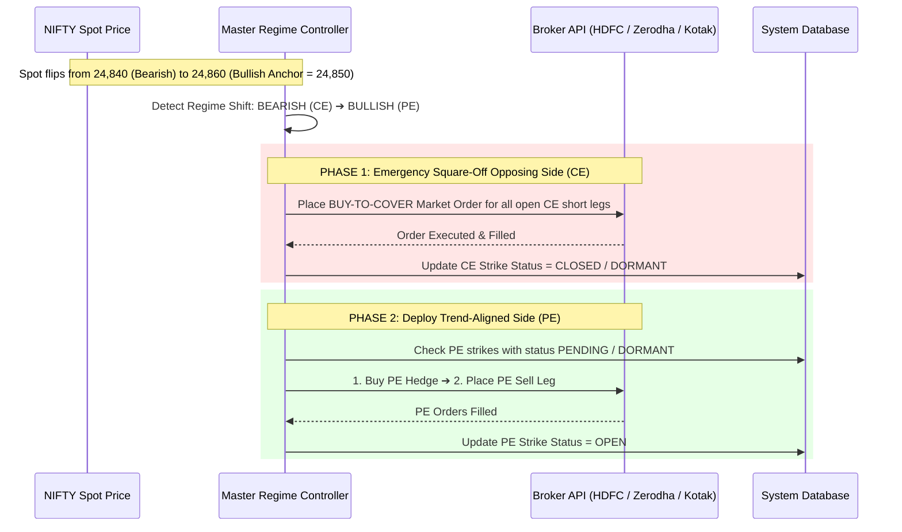

# 🌐 BHARAT MASTER NIFTY ANCHOR & SINGLE-DIRECTIONAL REGIME SYSTEM (V2.0)
## **Universal Production Implementation Blueprint (HDFC / Zerodha / Kotak Neo / Multi-Broker)**

---

## 📌 1. ARCHITECTURAL OVERVIEW & PROBLEM STATEMENT

### The Flaw of Traditional Dual-Sided (Strangle) Selling:
In standard option selling systems (selling both CE and PE strikes simultaneously):
1. When Nifty enters a sustained trend (sharp rally or steep sell-off), the wrong side gets stopped out repeatedly through sudden anchor jumps.
2. The winning side's slow time decay cannot compensate for the rapid delta spikes on the losing side.
3. Re-entries triggered on the wrong side result in costly whipsaws and consecutive losses.

### The Universal V2.0 Solution:
The **Master Nifty Anchor** creates a **Macro Regime Governor** above all individual strike factory rules:
$$\Large \mathbf{Single\text{-}Directional\text{ }Exposure:\text{ }At\text{ }any\text{ }moment,\text{ }the\text{ }engine\text{ }trades\text{ }ONLY\text{ }CALLS\text{ }or\text{ }ONLY\text{ }PUTS.}$$



---

## 🧭 2. CORE SPECIFICATIONS & RULES

### Rule 1: Master Nifty Anchor Parameter
- **Parameter**: `master_nifty_anchor` (float, stored in database/config).
- **Set Methods**:
  1. **Manual Entry via UI**: Operator specifies a key support/resistance level (e.g. `24,850.00`).
  2. **1-Click Lock Current Spot**: Button to instantly capture live Nifty Spot.
  3. **Auto 9:15 AM Open Snapshot (Optional)**: Can capture daily market opening spot.

---

### Rule 2: Regime State Table

| Nifty Spot vs Master Anchor | Active Regime | Allowed Sell Leg | Opposing Side Status | Action on Opposing Side |
| :--- | :--- | :--- | :--- | :--- |
| **Spot $\ge$ Master Anchor** | **BULLISH** | **PUT SELL (PE)** | **CALL (CE) $\rightarrow$ DORMANT** | Any open short CE is automatically **Market-Covered & Closed** |
| **Spot $<$ Master Anchor** | **BEARISH** | **CALL SELL (CE)** | **PUT (PE) $\rightarrow$ DORMANT** | Any open short PE is automatically **Market-Covered & Closed** |

---

### Rule 3: The "Kill & Flip" Automatic Transition Protocol

When Nifty crosses the Master Anchor level:



#### Transition Safety Rules:
1. **Zero-Lag Market Execution**: Opposing side is covered immediately using a marketable limit / market order to eliminate directional risk instantly.
2. **Whipsaw Guard (Hysteresis Buffer)**:
   - When Nifty oscillates tightly around the Anchor level (e.g. 24,848 to 24,852), a configurable buffer ($\pm 10$ to $\pm 15$ points) or 1-minute confirmation timer prevents false flip-flopping.
3. **Orphan Hedge Retention / Profit Bank**:
   - The opposing hedge can either be closed or maintained as an active profit lock orphan if volatility spikes.

---

### Rule 4: Sub-Engine Operations (Factory Rules Intact)

Once a regime is active:
- Individual strike-level mechanics continue to operate exactly as standard:
  - **Stop Loss**: `LTP >= Strike Anchor + Buffer` triggers individual leg exit.
  - **Decay Benefit**: Profit harvesting continues uninterrupted.
  - **Auto Re-Entry**: `LTP < Strike Anchor` triggers re-entry **only if Master Regime still approves that side**.

---

## 🏗️ 3. SYSTEM IMPLEMENTATION ROADMAP (FOR ANY BROKER)

This 5-Brick modular structure can be dropped into any trading engine codebase:

```text
┌─────────────────────────────────────────────────────────────┐
│ BRICK 1: Database & Configuration Schema                     │
│  - Add master_nifty_anchor, regime_buffer, regime_mode to DB│
└───────────────────────────┬─────────────────────────────────┘
                            │
┌───────────────────────────▼─────────────────────────────────┐
│ BRICK 2: Live Spot Price Streamer                           │
│  - Unified get_nifty_spot() adapter across brokers          │
└───────────────────────────┬─────────────────────────────────┘
                            │
┌───────────────────────────▼─────────────────────────────────┐
│ BRICK 3: Master Regime Evaluator Engine                     │
│  - evaluate_master_regime() runs every P&L cycle (15-30s)   │
│  - Auto-closes opposing side & enables active side          │
└───────────────────────────┬─────────────────────────────────┘
                            │
┌───────────────────────────▼─────────────────────────────────┐
│ BRICK 4: Dashboard UI Regime Control Bar                    │
│  - Live Spot display, Master Anchor input & 1-Click Lock    │
└───────────────────────────┬─────────────────────────────────┘
                            │
┌───────────────────────────▼─────────────────────────────────┐
│ BRICK 5: Broker Adapters (HDFC / Zerodha / Kotak Neo)        │
│  - Standardized order execution & position sync             │
└─────────────────────────────────────────────────────────────┘
```

---

## 🔌 4. BROKER ADAPTER MAPPING

| Module | HDFC Securities InvestRight | Zerodha Kite Connect | Kotak Neo API |
| :--- | :--- | :--- | :--- |
| **Spot LTP Fetch** | `hdfc_executor.get_ltp(token="26000", symbol="NIFTY")` | `kite.ltp("NSE:NIFTY 50")["NSE:NIFTY 50"]["last_price"]` | `neo.quotes(instrument_tokens=[...])` |
| **Buy to Cover (Exit)** | `execute_buy_and_confirm(symbol, token, qty)` | `kite.place_order(variety='regular', exchange='NFO', tradingsymbol=sym, transaction_type='BUY', quantity=qty, order_type='MARKET', product='NRML')` | `neo.place_order(exchange_segment='nse_fo', product='NRML', transaction_type='B', ...)` |
| **Sell Execution** | `execute_sell_and_confirm(symbol, token, qty)` | `kite.place_order(variety='regular', exchange='NFO', tradingsymbol=sym, transaction_type='SELL', quantity=qty, order_type='LIMIT', price=p, product='NRML')` | `neo.place_order(exchange_segment='nse_fo', product='NRML', transaction_type='S', ...)` |
| **Position Sync** | `hdfc_executor.get_positions()` | `kite.positions()["net"]` | `neo.positions()` |

---

## 🖥️ 5. DASHBOARD UI REGIME BAR DESIGN

```text
===================================================================================================
🎯 MASTER NIFTY REGIME CONTROLLER
---------------------------------------------------------------------------------------------------
NIFTY Spot: ₹24,874.60  |  Master Anchor: [ 24,850.00 ]  |  Buffer: [ 15.0 pts ]
ACTIVE REGIME:  🟢 BULLISH (PUT SELLING ACTIVE)    |    MUTED SIDE: 🔴 CALL SELLING (DORMANT)

[ ⚡ Lock Current Spot (24,874.60) ]     [ ✏️ Update Anchor ]     [ 🔄 Re-Evaluate Regime ]
===================================================================================================
```

---

## 🛡️ 6. BENEFITS & CAPITAL PROTECTION SUMMARY

1. **Drawdown Reduction**: Completely eliminates the 60–80% of losses caused by fighting a strong trending market.
2. **Zero Split Exposure**: No margin divided between losing calls and winning puts — full capital deployed on trend-aligned decay.
3. **Clean Universal Standard**: Same code runs seamlessly on HDFC, Zerodha Kite, and Kotak Neo.
