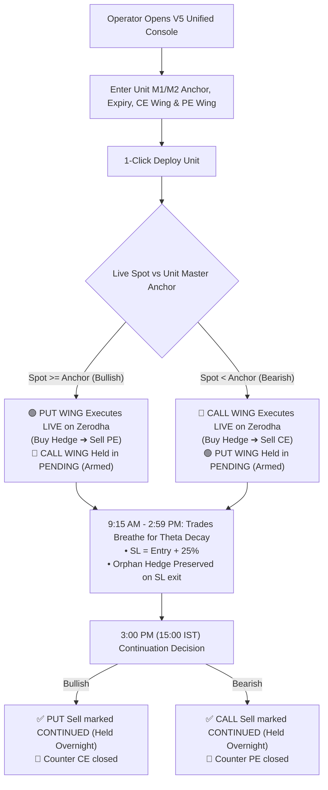

# 🚀 BHARAT SYSTEM V5.0 "OLD & GOLD" PRODUCT UPGRADE BLUEPRINT
## **Clean Universal Production Standard (Zerodha Kite Connect)**
_Date: 08-September-2026 | Version: V5.0 "Old & Gold" Architecture_

---

## 🔍 1. ROOT CAUSE ANALYSIS: WHY THE HYBRID / V3.0 SYSTEM FAILED ("Kyun Blunder Hua")

| # | Root Cause Issue | V3.0 Flaw / Hybrid Blender | V5.0 "Old & Gold" Clean Solution |
|---|---|---|---|
| **1** | **Global vs Unit Master Anchor** | V3.0 maintained a single global `master_nifty_anchor` at the app level. When building Unit `M2`, global anchor fallbacks conflicted with `M2`'s dedicated anchor. | **No Global Master Anchor**. Every unit (`M1`, `M2`, `M3`...) is an independent pod with its own dedicated `master_anchor_price`. |
| **2** | **Stop Loss at LTP instead of 25% Away** | In manual forms, `sl_price` was not set, and engine fell back to `buffer_tolerance` (₹2.00 above LTP), triggering immediate exit right at LTP! | **Strict 25% Stop-Loss Invariant**: Trigger is explicitly calculated and stored as $P_{\text{entry}} \times 1.25$. No trade exits at LTP. |
| **3** | **Intraday Kill & Flip Whipsaws** | V3.0 closed opposing positions every time Spot crossed the Anchor intraday, killing trades during normal market oscillations. | **Intraday Noise Decoupling**: Spot crossings between 09:15 and 14:59 IST **never close trades**. Positions breathe for theta decay. |
| **4** | **3:00 PM vs EOD Positional Trade Loss** | EOD watchdog / background routines closed positional trades at 3:00 PM/3:36 PM instead of carrying them forward. | **3:00 PM Continuation Protocol**: Favorable side marked `CONTINUED` and carried forward overnight (Positional). Only counter side + stranded hedges cleaned up. |
| **5** | **Multi-Window Operator Fatigue** | V3.0 required creating blocks first, then adding CE legs, then PE legs separately. | **Unified Single-Window Console ("Ek Hi Jagah Saari Chijen")**: Configure M1/M2 with CE Wing + PE Wing + Anchor on 1 screen $\rightarrow$ 1-Click Deploy! |

---

## 🏛️ 2. THE CORE GOLDEN INVARIANTS OF V5.0

---

## 🧭 3. DETAILED TECHNICAL SPECIFICATIONS

### A. Dedicated Unit Master Anchor (Per Unit Isolation)
- `M1` has its own anchor (e.g. `24,850.00`).
- `M2` has its own anchor (e.g. `24,500.00`).
- Each unit independently checks its own anchor against live Spot. There is zero interference between `M1`, `M2`, and `M3`.

### B. Single-Window Console ("Ek Hi Jagah Saari Chijen")
- Top row: Expiry Date, Unit Name (`M1`/`M2`), Master Anchor Price (with 1-Click Spot sync), Lots.
- Left Column: **Call Sell Wing** (CE Sell Strike, CE Hedge Strike, 25% SL Dropdown, Re-entry checkbox).
- Right Column: **Put Sell Wing** (PE Sell Strike, PE Hedge Strike, 25% SL Dropdown, Re-entry checkbox).
- Bottom Action: Single **🚀 DEPLOY UNIFIED MASTER UNIT NOW** button.
- **Selective Execution**:
  - If Bullish ($\text{Spot} \ge \text{Anchor}$): PE Hedge is bought first $\rightarrow$ PE Sell leg placed on Zerodha. Call Wing stored as `PENDING`.
  - If Bearish ($\text{Spot} < \text{Anchor}$): CE Hedge is bought first $\rightarrow$ CE Sell leg placed on Zerodha. Put Wing stored as `PENDING`.

### C. 25% Stop-Loss Invariant ($P_{\text{entry}} \times 1.25$)
- Trigger price:
  $$\text{SL Trigger Price} = P_{\text{entry}} \times \left(1 + \frac{\text{SL}_{\%}}{100}\right)$$
- If sold at ₹100, SL trigger is ₹125.
- Stored directly in `sl_price` in database.
- Checked every 30-second cycle against option LTP.
- When breached:
  - Short leg is bought back / covered.
  - Linked long hedge is **NEVER closed** (Orphan Hedge Invariant).

### D. The 3:00 PM Continuation Decision (15:00 IST)
- At exactly 15:00 IST:
  - Unit Spot vs Anchor is evaluated.
  - Trend-aligned side is marked `trade_state = "CONTINUED"` for overnight multi-day positional holding (`PRODUCT_NRML`).
  - Opposing side sell leg is closed.
  - Paired opposing hedge is closed.
  - Stranded orphan hedges are preserved or closed as per policy.
  - **Positional trades remain open overnight**.

---

## 🗑️ 4. COMPLETE REMOVAL OF V3.0 LEGACY FILES

The following obsolete V3.0 files have been retired from the workspace:
1. `RUN_ZERODHA_V3.bat`
2. `STOP_ZERODHA_V3.bat`
3. `START_V3_REPAIR.bat`
4. `sister_v3_auto_repair.py`
5. `SISTER_V3_REPAIR_AND_UPGRADE_GUIDE.md`
6. `test_v3_multi_anchor.py`

Clean V5.0 tools in use:
- `RUN_ZERODHA_V5.bat`
- `lego0_diagnose.py` (VPS Diagnostics)
- `lego1_deploy.py` (VPS Deployment)
- `test_v5_old_and_gold.py` (Verification Suite)

---

## 🚀 5. VPS DEPLOYMENT & VERIFICATION CHECKLIST

1. Run local test suite: `python test_v5_old_and_gold.py`
2. Execute SSH deploy: `python lego1_deploy.py`
3. Verify VPS health: `python lego0_diagnose.py`
4. Access Dashboard: `http://5.75.250.104:9007`
